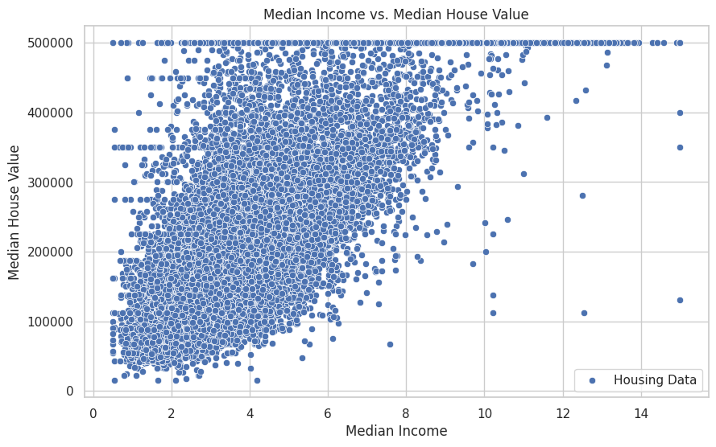
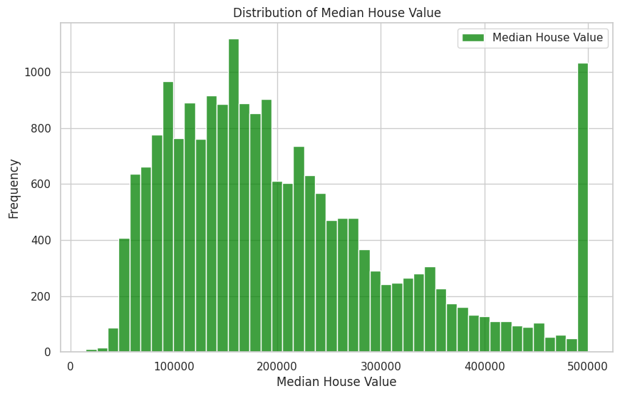

<!-- Top Dashboard Gallery -->

  
  

  
  

# CALIFORNIA-HOUSING-PRICES-

This project explores the California housing dataset to understand the factors affecting median house values. Using data visualization and analysis, key patterns and relationships are highlighted to inform data-driven decisions.

---

## Visualizations

### 1. California Housing # California Housing Prices

## Key Insights
- Median house value shows a strong correlation with median income and proximity to the ocean.  
- Certain features are more predictive of housing prices than others, helping focus analysis on important variables.  
- Geographical visualization highlights regional differences in house prices across California.  

---

## Technologies Used
- Python  
- Pandas, NumPy for data manipulation  
- Matplotlib, Seaborn for visualization  
- Jupyter Notebook for analysis  

---

## Conclusion
This analysis demonstrates how data visualization can uncover patterns in real estate data. Insights gained here can support investment decisions, urban planning, and understanding socio-economic trends in California housing.

  
