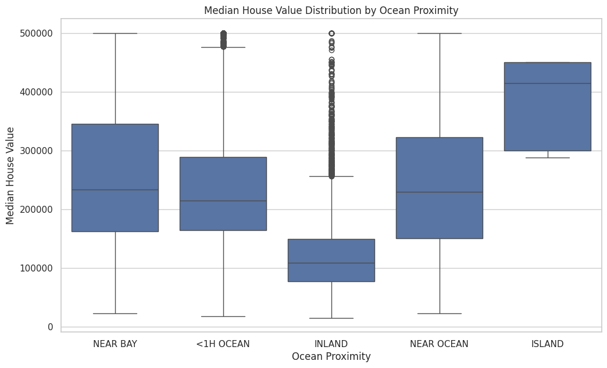
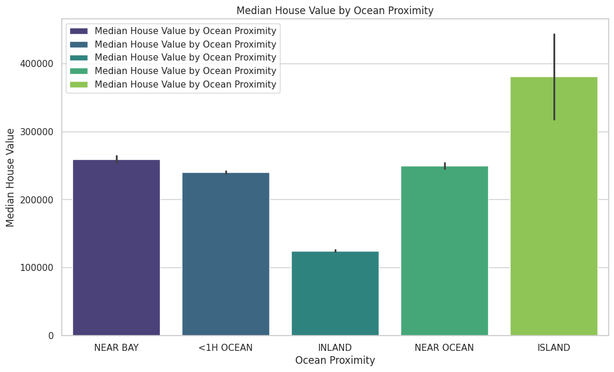

# CALIFORNIA-HOUSING-PRICES-
An exploratory data analysis project examining factors influencing house prices in California using Python and data visualisation.

# California Housing Prices

# Feature Correlations

# Price vs Median Income

# Geographical Map of Housing

# California Housing Prices

